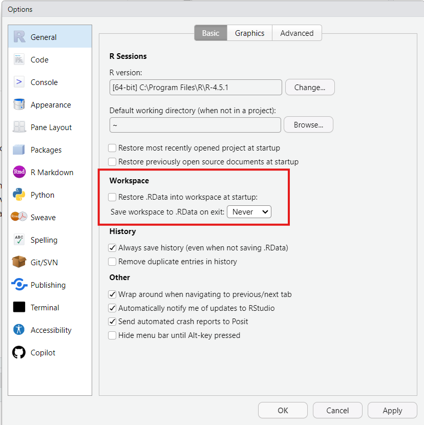
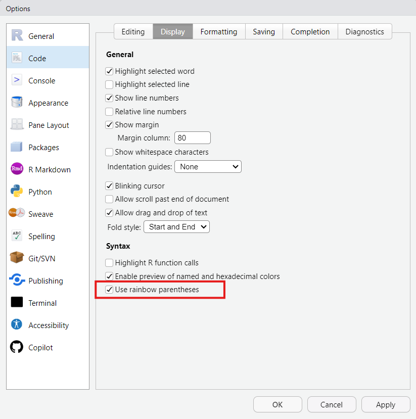

# Introduction

You should complete these brief set-up steps first before you begin the practical sessions for the Advanced Research Methods module.

These steps are critically important to avoid encountering issues later on. That is, the instructions for future practical sessions assume that you have set up R in this way. If you switch devices later on (e.g., if you are working on university PC, but later decide to follow-up on some practical activities on your own laptop), you should come back to this page and make sure that you have completed these steps.

# File storage

When you want to input and output files from R, you will need to tell R exactly where on your computer to find it. This can be a pain for two reasons:

1.  Filepaths can be long and faffy to work with.
2.  If you want to use your script elsewhere or share it with someone else, the script will need to be edited again, which means more faff.

We will get around this issue by setting up our practical work as an *R Project.* This will mean that R knows the file location we are working in, and we can keep all our datasets and analysis scripts together in one place.

## Set up your folders

Let's first create a folder to store all of your practical work.

1\) Open the file browser on your computer. On Windows, you can do this by clicking *Start \>\> File Explorer*.

2\) Navigate to your *Documents* folder.

3\) Create a new folder, and call it "**ARM_Practicals**".

4\) Within this new folder, create one folder called "**scripts**", and another folder called "**data**".

::: callout-tip
*Note that R is case sensitive, meaning that if you capitalise letters here then you will also need to be specific in your capitalisation in the scripts. It is a good idea to adopt a consistent approach to avoid later issues. Here we have used lower case, and strongly advise you to do the same so that you don't get confused later on.*
:::

When you download datasets for the practicals in the future, you should save them in your data folder. Similarly, when you create scripts in each practical, save them in the scripts folder.

## Initiate an R Project

Now let's tell R where we want to work during these practicals.

1\) Open RStudio*.*

2\) At the top of the window, click *File \>\> New Project...*

3\) After a bit of thinking (be patient!), a "New Project Wizard" window should appear. Click the *Existing Directory* option in the middle, to associate this new project with an existing working directory. We choose this option because we have already set up our folders manually in the previous step.

4\) On the next window, click "Browse..." and then navigate to your ARM_Practicals folder. Once you are in it (and can see your data/scripts folders), click "Open".

5\) Click "Create Project".

The name of the R Project you are working in should now show in the top right hand corner of your window, like this:

{fig-alt="An R cube icon from the top right-hand corner of the screen, accompanied by the text ARM_Practicals to show the project we have open." fig-align="center"}

If it doesn't, retrace your steps and try again. If it still doesn't work, put your hand up and ask for help.

## Moving forwards

The instructions for the practicals will assume that you have set up R in this way. We will follow three key principles:

1\) Open the R Project at the start of every session. You can do this by double clicking it from your file browser, or clicking *File \>\> Open Project...* from within RStudio.

2\) Save the data files in the data folder, once you have downloaded them from the VLE.

3\) Save your scripts in the scripts folder.

More on what these mean in the remainder of Practical 1!

# RStudio settings

There are a few other settings that can be useful to change when you first begin working in RStudio.

## Saving the workspace

One irritating default of RStudio is that it saves everything automatically on exiting. This might sound like a great idea, but in reality it can mean that you have a very messy workspace and that mistakes can emerge from using old material. To turn this off (highly recommended):

1\) At the top of RStudio, click *Tools \>\> Global Options...*

2\) On the *General* panel that should open in the window, there is a section titled *Workspace.*

3\) Make sure that the *Restore .RData\[...\]* box is unticked, and that it is set to never save the workspace on exit.

4\) Click "Apply" to save the settings.

{fig-alt="The Workspace options are highlighted to show that \"Restore .RData into workspace at startup:\" is not ticked, and the \"Save workspace to .RData on exit:\" is set to Never." fig-align="center"}

## Rainbow parentheses

Sometimes we will need to wrap things inside multiple nested brackets. You don't need to worry about what this means for now, but whilst we're on the settings, we might as well set up one of my favourite most useful features: rainbow parentheses! This setting colour codes your brackets so that you can tell which ones are paired together. And who doesn't want a bit of colour on their scripts?!

1\) On the Global Options... window you have open, click on "Code" down the left hand side.

2\) Click the "Display" tab at the op.

3\) Under syntax, check the box that says "Use rainbow parentheses".

4\) Then click "Apply", and/or "OK" to close the window.

{fig-alt="The Syntax option \"Use rainbow parentheses\" is ticked."}

As for what this has done? Well, you'll just have to wait and see as we get writing scripts...

# You're now ready to go!

Now proceed with the first Practical session: **1_Introduction**.
