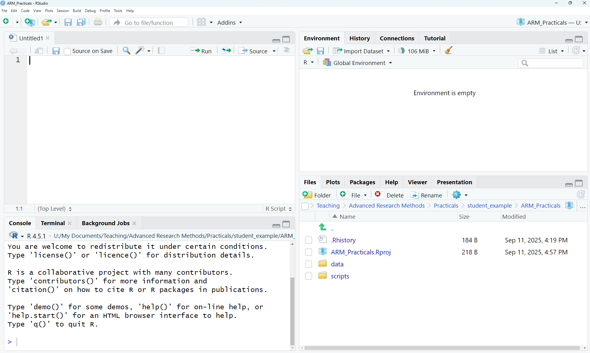
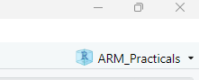

```{r housekeeping, echo = FALSE, eval = FALSE}
# Note: to render to both html and pdf formats, run quarto render [filename] in the terminal

# This code block is used to create datasets for the practical. 
# This week's exercise is simulated based on Cutting et al. (2023) 

library(tidyverse)
library(faux)

# DATASET 1: Analyses with two variables 

## T-test - 2 groups
non_gamers <- data.frame(ppt_id = 1:50, 
                         gamer = "n",
                         wmc = round(rnorm(n = 50, mean = 8.1, sd = 2)))
gamers <- data.frame(ppt_id = 51:100, 
                         gamer = "y",
                         wmc = round(rnorm(n = 50, mean = 9.2, sd = 2.3)))
gaming_dat <- bind_rows(non_gamers, gamers) 

## Add correlation data - use age for initial analysis, hours for extra exercise 
gaming_dat$age_years <- round(rnorm_pre(gaming_dat$wmc, mu = 45, sd = 15, r = -0.22, empirical = TRUE)) 

temp <- filter(gaming_dat, gamer == "y")
temp$hours <- round(rnorm_pre(temp$wmc, mu = 12, sd = 5, r = 0.1, empirical = TRUE))

gaming_dat <- gaming_dat %>% 
  left_join(temp, by = c("ppt_id", "gamer", "wmc", "age_years")) %>% 
  mutate(age_years = ifelse(age_years < 18, 18, age_years)) %>% 
  select(ppt_id, age_years, gamer, hours, wmc)

## Check
t.test(wmc ~ gamer, data = gaming_dat)
cor.test(gaming_dat$age, gaming_dat$wmc)
cor.test(gaming_dat$hours, gaming_dat$wmc, use = "complete.obs")

## Save 
write.csv(gaming_dat, "./data/ARM1_data1_gamers.csv", row.names = FALSE)

# DATASET 2: One-way ANOVA 
strategy <- data.frame(ppt_id = 1:30, 
                         type = "strategy",
                         wmc = round(rnorm(n = 30, mean = 9, sd = 2.1)))
puzzle <- data.frame(ppt_id = 31:60, 
                         type = "puzzle",
                         wmc = round(rnorm(n = 30, mean = 8.1, sd = 2)))
action <- data.frame(ppt_id = 61:90, 
                         type = "action",
                         wmc = round(rnorm(n = 30, mean = 7.2, sd = 1.5)))
game_type <- bind_rows(strategy, puzzle, action)

## Check 
summary(aov(wmc ~ type, data = game_type))

## Save
write.csv(game_type, "./data/ARM1_data2_gametype.csv", row.names = FALSE)
```

# Introduction

The overarching aim of this practical is to get you used to the R environment. The best way to do this is to start with something you already know about: basic statistics from your first and second year. Along the way we will introduce basic concepts common to all programming languages, with no prior programming knowledge assumed.

::: {.callout-note title="Learning objectives" icon="false"}
By the end of this practical, you will be able to:

1.  Use *RStudio* to write, comment, and execute lines of code.
2.  Create and manipulate objects in *R.*
3.  Load data files into *R.*
4.  Calculate basic summary statistics.
5.  Implement common inferential tests, including a t-test, correlation, and ANOVA.
:::

------------------------------------------------------------------------

# Navigating RStudio and creating objects

Here is the main window of *RStudio* (shown on a Windows PC, although it should look very similar on a Mac!). You can see that it has four different sections.

{fig-alt="RStudio consists of four panels, for scripts, the console, the environment, and viewing." fig-align="center"}

## Top left: Scripts

In the top left corner of the image is a quadrant for your scripts. You won't see this quadrant when you first open R, but it will show when you create one in Section 2.

Scripts are like lists of instructions for the computer to follow. You can save them just like a Word document, and this makes it easy to set up complex analyses without typing them in by hand each time. Throughout these practicals, you will create several scripts that you can later adapt and reuse in running statistical analyses.

## Bottom left: Console

The lower left window is called the *Console*. This is where the magic happens! Here, you can type in individual commands to ask the computer to do something. You can use it just like a calculator: try clicking in the console and typing `20 + 57` (or indeed any other sum you choose!). If you press the Enter/Return key, you should see the answer printed below.

We can also instruct the computer to create an "object" (or "variable"[^1]). An object is like a box that you can store information in. Some objects are big, such as large datasets that contain many numbers or even chunks of text. Others might contain only one number.

[^1]: In programming, "variables" are used to store information in memory. In *R,* a language used for statistics, these are commonly referred to as "objects" to avoid confusion with the use of "variable" in relation to your data (i.e., a column in your dataset, your independent/dependent variables). You will see these referred to as either, and either is fine.

First, let’s create an object called `a`, and give it the value 5. Click on the Console area and type:

```{r create-object}
a <- 5
```

Then hit the Enter/Return key to run it. You will see the arrows `<-` a lot in R: they are used to assign (or store) everything on the right to the name that you provide on the left[^2].

[^2]: If you already have some programming experience, you might be more used to using the `=` symbol to assign values. This works fine in *R* too so can be used if you prefer. However, using the `<-` is more clearly distinguished from other aspects of *R* code, and so is more readily used/taught.

## Top right: Environment

If you have created an object, `a`, you should now see that it has appeared in the top right section, in the *Environment* tab, with the assigned value 5. This means that we can now treat `a` as though it is a number: we can run mathematical operations on the object, and get out an answer that depends on the value assigned. You can try this now by typing `a*2` into the console to multiply it by two, or `a^2` to square it.

So why not just type 5\^2 in the first place? The reason objects are useful is that we can change and update their values, or include many numbers in them. Let's make a new object called `b` with the numbers 1-5, and see what happens when we square it:

```{r square-object-list}
b <- c(1, 2, 3, 4, 5)
b^2
```

You can see that we now get a list of the squares of all the elements.

We will use objects to store and manipulate data in *R*, similar to how we might work on a spreadsheet or SPSS file. You can always inspect the objects you have to hand and the values assigned to them by looking in the Environment panel.

## Bottom right: Other things!

The bottom right window has several sections that can be navigated by clicking on the tabs at the top. *Files* shows the files in the directory that we are working from, *Plots* will contain any figures that we create, *Packages* contains a list of extensions that will enable us to do different types of statistics, and the *Help* table will show the help pages for a particular function if we ask for them (we'll do this a lot!).

------------------------------------------------------------------------

# Creating a script and loading in data

In this section, we will create a script to tell us about the mean, median, standard deviation, and standard error of some data. Rather than type the data in by hand, we will load a dataset from a file—just as we would if we had run an experiment.

## Opening your R Project

Make sure that you are working in the R Project **ARM_Practicals**. This should be the case if you have just completed the 0_SetUp instructions. If not, or if you closed RStudio in between, you can open this by clicking *File \>\> Open Project...* and navigating to the project file we created.

Remember, you should be able to see this in the top-right corner of the RStudio window.

{fig-alt="The project name reads \"ARM_Practicals\"" fig-align="left"}

## Creating a script

Look to the top left of your RStudio window. Click the button that has a white square and cross in a green circle (or alternatively, click *File \>\> New File \>\> R Script*). Now you have a script open, let's save it so that we can keep saving our progress as we go. Click *File \>\> Save As...* and navigate to the scripts folder inside the ARM_Practicals folder you created. Once you are in this folder, save your script with the name **ARM1_intro.R**.

## Loading data into R

There is a file in the Lecture 1 section of the VLE called **ARM1_data1_gamers.csv**. This is a .csv file, which is a readily used data storage format that can be opened by many different software[^3]. Download this file, and save it in the folder we previously created (likely *Documents/ARM_Practicals/data/*).

[^3]: If you wish to read in different file types in the future (e.g., .xlsx, .sav), there are many different bespoke packages available that will support you in doing this (e.g., read_excel, haven).

At the top of your script file, you can now instruct R to read in the dataset by adding the following line:

```{r load-dat1}
gamer_dat <- read.csv("./data/ARM1_data1_gamers.csv")
```

We are creating an object in R here called `gamer_dat`, and using the `<-` to assign something to it. Here, we want to assign the data file that we load in, so need to instruct it to find and load the data file. We use `read.csv()` to tell R that we want to load in a csv file. We tell it the file path to where the dataset is stored: the `./` affirms that we are starting in the current directory (your R project folder), then `data/` instructs it to look in the data folder, then the final part is the name of the file (including the .csv extension).

Now you have typed this into your script, you need to execute it. You can do this by highlighting it with your mouse and then clicking 'Run' at the top of the script. Alternatively, if your cursor is on the correct line, you can hit Ctrl + Enter on your keyboard.

If you are successful, you should see an object called `gamer_dat` appear in the *Environment* tab. You can see that it has 100 observations (rows) for 5 variables (columns). If you click the little grid to the right of this description, you can inspect the dataset in your top left panel. You should see that the five columns correspond to:

- **ppt_id**: a unique identifying code for each participant
- **age_years**: their age in years
- **gamer**: whether they play video games (y) or not (n)
- **hours**: if they do play video games, how many hours they play per week on average (or NA if they don't, meaning that it's a missing value)
- **wmc**: working memory capacity

*This dataset was simulated for the purposes of today's practical, but was inspired by a [research study](https://doi.org/10.1016/j.heliyon.2023.e19098) by Fiona McNab.*

------------------------------------------------------------------------

# Calculating summary statistics

R has many built in functions to calculate basic descriptive statistics. Now you have loaded your data, try adding the following line to your script:

```{r mean-preview, eval = FALSE}
mean(gamer_dat$wmc)
```

In this section of code, `mean()` calls the function to calculate the mean statistic. Inside the brackets, you need to tell the function what to calculate the mean of. We've referenced this by using the name of the object (i.e., the `gamer_dat` label we gave the dataset when we loaded it in), and then used the `$` sign to specify which variable of the object we are interested in (here, `wmc`).

Now you have typed this into your script, you need to execute it. You can do this by highlighting it with your mouse and then clicking 'Run' at the top of the script. Alternatively, if your cursor is on the correct line, you can hit Ctrl + Enter on your keyboard. You should see that your line of script now appears in the Console, followed by the answer as follows:

```{r mean-run}
mean(gamer_dat$wmc)
```

If it hasn’t worked, go back over the previous instructions carefully and see if you missed a step. The console will contain any error messages in red. If you are still stuck, raise your hand.

You can calculate some other descriptive statistics, and create a histogram as follows:

```{r desc-examples, eval = FALSE}
median(gamer_dat$wmc)
sd(gamer_dat$wmc)
sd(gamer_dat$wmc)/sqrt(length(gamer_dat$wmc))
hist(gamer_dat$wmc)
```

These lines compute the median, standard deviation and standard error, and then plot a histogram. If you select your entire script and run it, you will see these values appear in the *Console* and a histogram of the data appear in the *Plots* window. Well done – you have just written your first *R* script![^4]

[^4]: The eagle-eyed among you might also see that you have your first example of rainbow brackets, if you turned on this setting during the 0_SetUp task!

::: {.callout-tip title="Take note! (literally)"}
Before we go any further, we should talk about good coding practices. It’s very helpful if you can add comments to your code to say what you are doing in each section. This is helpful as a learner, allowing you look back at the scripts that we write in these practicals without having to match it up with this worksheet. It’s also good practice as you write more advanced scripts: future you will be very grateful for notes explaining what you are doing at each step.

You can add comments to your script by using the \# symbol. When R encounters the \# symbol, it knows not to try and interpret the remainder of that line as code. This means that you can either write comments on their own line or directly next to code, like in the example below.

Try it now: add comments to the code you have already written so that future you will remember what this code does. You should try to do this throughout all the practicals: I have often written basic comments alongside sections of code, but you can edit these and add more notes to your scripts to help you to remember key things.
:::

```{r comment-example, eval = FALSE}
# Calculate descriptive statistics 
mean(gamer_dat$wmc)  # mean 
sd(gamer_dat$wmc)    # standard deviation
```

------------------------------------------------------------------------

# Running inferential tests

## Running a t-test

In Years 1 and 2, you learned about some inferential statistics that test the relationship between two variables.

One way to analyse the data that you have loaded is to run a t-test to test the difference in means between two groups. Let's test the hypothesis that gamers versus non-gamers have different working memory capacity. You can do this by adding the following line of code to your script:

```{r t-test, eval = FALSE}
t.test(wmc ~ gamer, data = gamer_dat)
```

Within the t.test call, we have asked for our dependent variable (`wmc`) to be predicted by (`~`) the variable `gamer`, which we have seen has two levels (*y, n*). We don't actually have objects called `wmc` and `gamer` in our R environment, so we specify that it should look for these within the `gamer_dat` dataset.

Running this line of code should give you the following output:

```{r t-test-output, echo = FALSE}
t.test(wmc ~ gamer, data = gamer_dat)
```

The output tells us the test that we have run, and provides us with the necessary values for reporting on the third line of output: the *t*-statistic, degrees of freedom, and *p-*value. You can see here that there is a significant difference between the two groups as the *p* \< .05. The output also handily summarises the mean working memory capacity for each group.

## Running a correlation

Another simple analysis for testing the relationship between two variables is a correlation, which we can use to test the strength of association between two continuous variables. Let's test how working memory capacity changes with age, by typing the following line.

```{r cor-test, eval = FALSE}
cor.test(formula = ~ age_years + wmc, data = gamer_dat)
```

Running this line of code should produce the following:

```{r cor-test-output, echo = FALSE}
cor.test(formula = ~ age_years + wmc, data = gamer_dat)
```

Again, the output tells us the test that has been done, and shows us that there is a significant relationship between the two variables (*p* = 0.02). The final line of output, labelled as "cor", is the correlation coefficient, showing a negative correlation between the two variables: as age increases, working memory decreases.

These calls for statistical tests that we have just run are called *functions.* We also used functions above to read in the data, and gain some summary statistics. You can find out more about the options available for each function by typing e.g., `help(t.test)` or `help(cor.test)` in the *Console* (this is a bit meta, we use the `help()` function to ask for help about other functions)*.* This should bring up some helpful information in the bottom right window. The help pages tell you which "Arguments" you need to give to the function, and how to specify them. For example, we can see that to run a Spearman test rather than a Pearson's correlation, we should add the argument `method = "spearman"` inside the brackets. Try this now.

## Running an ANOVA

Finally, let's try running a simple one-way ANOVA. Now you've established that gamers have a higher working memory capacity than non-gamers, we might want to ask whether it matters what *type* of games people are playing. You run a new study and recruit only young adults who self-report as gamers. You measure their working capacity, and ask them to select their dominant game type.

Make sure that you have downloaded the data from the VLE and saved it in your data folder. Then let's load it into R and assign it to an object called `type_dat`. Inspect the dataset to see the game categories.

```{r load-dat2}
type_dat <- read.csv("./data/ARM1_data2_gametype.csv")
```

Given there are three levels of game type, we can no longer use a t-test to compare working memory between groups. Instead, we can use a one-way ANOVA.

The first step in running an ANOVA is to check the assumption of homogeneity of variance using Levene's test. This test isn't included as standard in R, so we need to load in a package (a set of functions that someone has written) to run it. You only need to run this once in each R session. Add the following lines to your script, and run them:

```{r levenes-test-print, eval = FALSE}
# Load car package
library(car)

# Run Levene's test
leveneTest(wmc ~ type, data = type_dat)
```

```{r levenes-test-silent, echo = FALSE}
# Load car package
library(car, quietly = TRUE)

# Run Levene's test
leveneTest(wmc ~ type, data = type_dat)
```

The output prints a warning that it interpreted our group (i.e., game type) as a factor. This is fine, that's what we want it to do! You can then see that the test is not significant, so we can assume that the variances are equal across the groups. This means that we can proceed with our ANOVA.

We can run the test and display the results using only two lines of code:

```{r anova, eval = FALSE}
# Run ANOVA and save output to object
gametype_model <- aov(wmc ~ type, data = type_dat)

# Print output summary
summary(gametype_model)
```

This will produce your ANOVA summary table as follows:

```{r anova-output, echo = FALSE}
gametype_model <- aov(wmc ~ type, data = type_dat)
summary(gametype_model)
```

Just like in SPSS, we can pick out the degrees of freedom (2, 87), the F ratio (4.806) and the *p*-value (.01). Here we can see that there is a significant difference in working memory capacity depending on the type of game that people play most regularly (*p* \< .05).

------------------------------------------------------------------------

# Summary

We’ve just introduced some important concepts in R, and gone through how to do some basic statistical tests. In fact, we did many of the things you already know about, but in only about 15 lines of code! Of course, R offers many more sophisticated options, e.g. for factorial ANOVAs, post-hoc tests, regression and so on. You are welcome to find out more about how to do these yourselves.

## Challenge yourself

If you have completed the practical in good time and want to challenge yourself, have a go at the following independent exercise. Use the first dataset (ARM1_data1_gamers.csv) to look more closely at the number of hours played.

- Use the descriptive statistics functions to work out the mean and standard deviation of this variable.
- Find one or more functions that give us the minimum and maximum number of hours played in the dataset.
- Examine the correlation between working memory capacity and the number of hours played, for the gamers only.

You might well encounter some errors along the way, and there are multiple ways to solve the problem. Try using the R help files or googling to fix the problem for yourself: this is a major part of coding! The solution(s) will be released next week.

## Further learning

**You do [not]{.underline} need to learn R to do well in this module**, but it's one way of getting to grips with different statistical techniques and many students enjoy the challenge. If you're serious about learning *R*, then the following DataCamp chapters are relevant to this week's content and will help to consolidate the material ready for the practicals ahead. You will need to sign up for a free account using the link from the VLE Module Information page.

- [Introduction to R](https://app.datacamp.com/learn/courses/free-introduction-to-r)
- [Hypothesis Testing in R](https://app.datacamp.com/learn/courses/hypothesis-testing-in-r)

You might also be interested in the R version of the Andy Field textbook (*Discovering Statistics using R*), if this is a familiar learning style for you. It has many example data sets and details of how to do different tests, and there are plenty of copies available in the library. Alternatively, there is a fantastic textbook for undergraduate psychology students developed by Danielle Navarro, which you can [access for free online](https://learningstatisticswithr.com/book/).

------------------------------------------------------------------------

::: {.callout-warning title="How's it going?" icon="false"}
Let us know how today went via this quick survey [via this survey](https://docs.google.com/forms/d/e/1FAIpQLSdxrvu8kUlKKbFLsFrLhkkWjD9GgFy4hd-kG6ds3N1A_vfCug/viewform?usp=publish-editor) - rate the difficulty and length, and leave any comments that would help for us to know (positive comments welcome too!). You will need to be logged in with your university account to respond, but your submission will be anonymous.

For more general questions about the practical, please post them on the [VLE Discussion Board](https://vle.york.ac.uk/ultra/courses/_117163_1/discussion/_6581034_1?view=discussions).
:::
