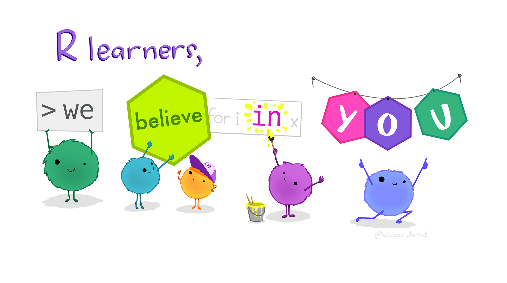
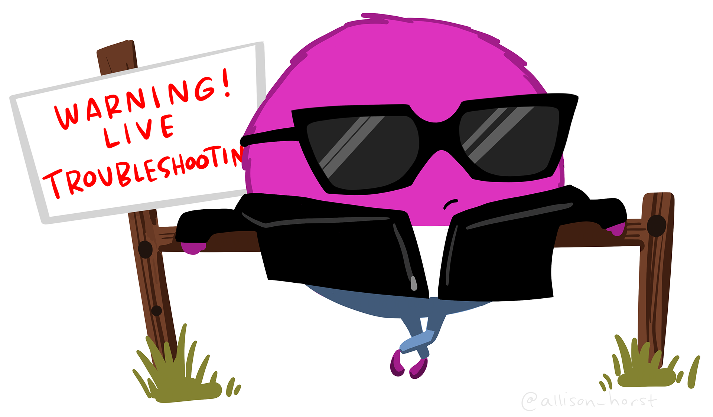

# Introduction

Welcome to *Advanced Research Methods!*

Each week's lecture content is available via the [VLE module page](https://vle.york.ac.uk/ultra/courses/_117163_1/outline). These course pages are where you will find the materials for the practical sessions. Each practical session will have its own page of instructions released throughout the semester. Instructions can also be downloaded in Word/PDF format should you prefer.

This page outlines how each practical session is set up. Before you begin in Week 1, you should also check out the [guidelines](arm0_setup.qmd) for setting up your workspace for this module.

# Practical format

We have a one-hour practical timetabled each week (typically 1pm or 3pm on Thursdays, PS/A/203). Each session has tasks for you to complete independently, with the session lead available to support and answer questions throughout.

{alt="Artwork by @allison_horst" fig-alt="Header text \"R learners\" above five friendly monsters holding up signs that together read “we believe in you.”" fig-align="center" width="497"}

## Preparation

We expect that you will come to this session having attended the lecture on Tuesday, or caught up via the recording if you were unable to make it in person. We also recommend that you should have done the core reading for the week to consolidate your understanding. Having done so will help you to engage fully with the practical session, and also enable you to ask questions about aspects that you did not understand.

## During the practical

The practical is self-paced. You should work through the instructions to create and annotate your own analysis script, checking your understanding and taking notes as you go.

Where we have hidden code sections, do your best to try and figure out the solution yourself before peeking! Trial and error is a much more effective way of learning, and will help you to build your coding skills.

You can count on getting stuck at various points during the practical sessions. Errors are a very normal part of coding, even if sometimes frustrating! If you get stuck, try the following:

1.  Spend time trying some different things! What's happening that you don't expect? Is there an error message, and does it tell you anything useful?
2.  Google it! Copying and pasting the error message into Google often takes you to help forums where others have asked about the same problem.
3.  Chat to the person next to you—maybe they can spot something in your code that you can't see?
4.  Put your hand up, and we'll come over to help!

{alt="Artwork by @allison_horst" fig-alt="A little monster in a cool black jacket and sunglasses, leaning casually against a fence with a sign reading \"Warning! Live troubleshooting!\"" fig-align="center" width="329"}

## Challenge yourself!

If you finish the exercises in good time or want to continue progressing after the practical, have a go at the independent exercise at the end.

# Feeding back

These sessions are designed to help you. Please use the survey link at the end of each week to let us know how you're getting on so that we can adjust as we progress throughout the module. It will take \<30 seconds to let us know whether the amount and difficulty of the content was suitable, and there's an open text box if you would like to any further comments beyond this. Thank you!
